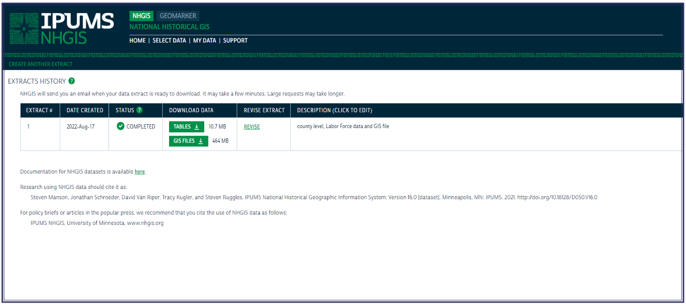

____________________________

```{r, include=FALSE}
library(ipumsr)
library(magick)
library(tidycensus)
library(tidyverse)
source("R/api-keys.R")
source("R/ipums-api-scripts.R")
set_ipums_api_key(apikey, overwrite=TRUE)
```

## Introduction to `ipumsr`

[IPUMS](https://www.ipums.org/) (Integrated Public Use Microdata Series) offers a comprehensive collection of census and survey information sourced globally, seamlessly integrated across time and space. One of their products, [IPUMS NHGIS](https://www.nhgis.org/), offers easily accessible summary tables and time series data. [`ipumsr`](https://tech.popdata.org/ipumsr/index.html) provides an easy to use R interface for interacting with many of the IPUMS projects. The greatest functionality, however, exists with the IPUMS NHGIS project as its the only existing product that supports browsing metadata. In addition to browsing metadata, the `ipumsr` package allows users to define and submit extract requests directly to the IPUMS servers and download and use the extract data. 

The `ipumsr` package facilitates a reproducible, flexible, and automated approach to accessing and manipulating census and survey data. Its reproducible as users can easily recreate extract definitions and share extract definitions with collaborators. Its flexible as users can quickly adjust or add extract definitions and easily access complete NHGIS metadata. Its automated as users can build complete workflows around the NHGIS data and the `ipumsr` functions. 

## `ipumsr` Compared with Other R Census Packages

The `ipumsr` package is different from the other R census packages, like `tidycensus` and `censusapi`. First, it has direct access to *cleaned* and *synthesized* Public Use Microdata (PUMS). Second, users have access to many of the different IPUMS projects like decennial Census data that dates back to the 1790 Census, international Census data, and other NHGIS products. Users can filter variables, locations, and data formats easily. The `ipumsr` package also grants access to the [NHGIS time series](https://www.nhgis.org/time-series-tables#standardization) data integrated into geographically standardized tables. In other words, much of the time series data has been standardized to one unit of geography across time. Currently, NHGIS provides 1990, 2000, 2010, and 2020 data standardized to *2010 census units*.

____________________________

## Using `ipumsr`
### Initial Setup

To install and use `ipumsr` you must first download it.

```{r,eval=FALSE}
install.packages("ipumsr")
library(ipumsr)
```

After downloading and loading the package, you must set up an API key since `ipumsr` is built on top of the IPUMS API. You can obtain your api key [here](https://account.ipums.org/api_keys).

```{r,eval=FALSE}
#set api key
set_ipums_api_key("your-api-key", save = TRUE)
```

And that's it! The setup for accessing NHGIS data entirely within R is complete.
  
### Browsing NHGIS Metadata

With the `get_metadata_nhgis` function, users can browse both summary and detailed metadata. Summary metadata provides information on data tables, time series tables, shapefiles, and all other available datasets.

```{r}
#browse metadata
nhgis_ds <- get_metadata_nhgis("datasets") 
nhgis_ds
```

### Defining and Submiting an Extract

In order to receive data from NHGIS, the user much define and submit an extract. 

```{r,eval=FALSE}
#define extract
nhgis_ext <- define_extract_nhgis(
  description = 'Table Description',
  datasets = ds_spec(
    "Table Name",
    data_tables = c("List of Table Headers"),
    geog_levels = "Unit of Geography"
  )
)
```

```{r,eval=FALSE}
#submit extract
nhgis_ext <- submit_extract(nhgis_ext)
```

After submitting the extract, the user must wait for the serves to process the request. After the request is processed, the user can download it.

```{r,eval=FALSE}
#download extract
nhgis_files <- download_extract(nhgis_ext)
```

### Time Series Example

The `ipumrs` package can be a powerful data analysis tool when working with Census and survey data. For example, below is a gif of how the intensity of Single Occupency Vehicle (SOV) Commuters changes over time at the city level along the Wasatch Front in Utah, USA. This specific example was generated from the nomilaly integrated time series tables provided by IPUMS NHGIS. It was created by defining and submiting an extract, downloading the data, and plotting the data on maps. Overall, this is just one example of the countless ways the `ipumsr` package can be used. 

```{r, echo=FALSE}
image_read("SOV-Commuters.gif")
```

____________________________

## Validating `ipumsr`

As part of the software badging process, its important to ensure the validity of the `ipumsr` package. Fortunately, IPUMS NHGIS makes it easy to keep track of your extract requests. Each time a user submits an extract, that extract is documented on the [NHGIS Extracts History](https://data2.nhgis.org/downloads/) page. This allows the user to *double check* that their extract matches the data table, variables, filters, and geographic unit they desired.

<div style="text-align:center">
  
</div>
<br>

The IPUMS data sources also provide detailed documentation explaining the process and validity of their data. For example, all tabular data sources are listed [here](https://www.nhgis.org/tabular-data-sources), all time series table information listed [here](https://www.nhgis.org/time-series-tables), all gis file information listed [here](https://www.nhgis.org/gis-files), and even revision history documentation listed [here](https://www.nhgis.org/revision-history). 

### Validating `ipumsr` against `tidycensus`

As a way to further validate the data, the following code shows the same data extracting from both `tidycensus` and `ipumsr`. With both packages, the estimated number of earners in each county of Vermont using the 2021 5-year American Community Survey (ACS) data is displayed (along with the margin of error). 

```{r,message=FALSE,warning=FALSE}
# use tidycensus to get the number of owners from the 2021 5yr acs
# load libraries
library(tidycensus)
library(tidyverse)

# define and save extract
vt <- get_acs(geography = "county", 
              variables = c(earners = "B19122_001"), 
              state = "VT", 
              year = 2021)
head(vt)
```
```{r,eval=FALSE,message=FALSE,warning=FALSE}
# use ipumsr to get the number of owners from the 2021 5yr acs
# define & submit extract
nhgis_ext <- define_extract_nhgis(
  description = 'tidycensus validation',
  datasets = ds_spec(
    "2017_2021_ACS5b",
    data_tables = c("B19122"),
    geog_levels = "county"
  )
)
nhgis_sub <- submit_extract(nhgis_ext, api_key = apikey)

# download extract
nhgis_files <- download_extract(nhgis_sub)
```

```{r,message=FALSE,warning=FALSE}
# display data as filtered by tidycensus
vt2 <- read_csv("data/nhgis0083_csv/nhgis0083_csv/nhgis0083_ds255_20215_county.csv") %>%
  filter(STATE == 'Vermont') %>%
  select(GEO_ID, NAME_E, AO8NE001, AO8NM001)
head(vt2)
```


The values are identical, thus validating the `ipumsr` package.

____________________________

## Badging Details

The Software Badging process requires that Zephyr answer the following three questions about a software package:

 1. Is the software useful to the Zephyr Community?
 2. Does the software contribute to a common problem space or benchmark in a manner that encourages community progress?
 3. Is the software easy to use?

The `ipumsr` package is definitely useful for the Zephyr community. It provides a reproducible, flexible, and automated approach to accessing a wide array of census and survey data products. Census data is critical to developing travel models, and so accessing it in such a way is highly beneficial.

Similar to the `tidycensus` package, `ipumsr` is not solving any particular "problem". However, it does stand as a testament to how useful open source software is in general. It encourages the development of open source software and its role in advancing the field of travel modeling and data analysis. In addition, it encourages the development of software packages that can expand upon the capabiliities of similar packaeges. The `ipumsr` package isn't revolutionary in its ability to access Census data via an R api (`tidycensus` already does this), however it *builds* upon the cabailities of what `tidycensus` offers and expands the breadth and variety of the data available. 

The `ipumsr` pacakge is easy to use. The documentation is exceptional, including examples on how to use each and every function, details behind the data of each data source, and even a page dedicated to the history of data extracts. Many webinars and pdfs exist with the sole purpose of helping users understand the software. The developers even encourage reaching out to them for any questions the users may have.

Overall, the `ipumsr` is an excellent open source package that merits a Zephyr software badge. 

## Resources
 
We'd like to acknowledge the resources that were referenced while writing this article, espeicially to *IPUMS NHGIS, University of Minnesota, www.nhgis.org*.

Other Specific Cites Referenced: 

 - https://assets.ipums.org/_files/webinars/slides/nhgis03-05-24.pdf
 - https://www.nhgis.org/time-series-tables#standardization
 - https://rpubs.com/corey_sparks/771176


